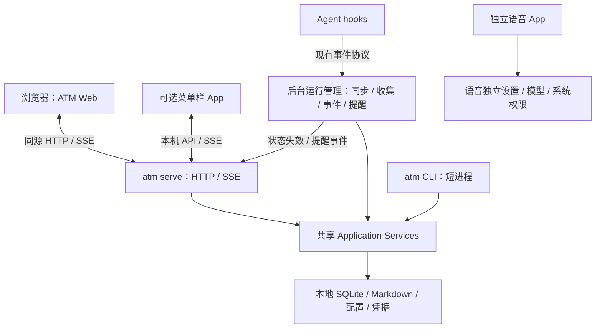

# ATM 本地 Web 工作区与应用拆分技术方案

日期：2026-09-03。状态：任务闭环和七个工作区已接入并通过浏览器验收；实际数据仅作只读预览。

本方案依据当前仓库源码和本次产品讨论编写。设计基线 Git HEAD 为 `c87f3cf`，工作区已有另一项 macOS 性能修复的未提交改动，迁移保留这些改动。本文描述完整目标；已落地范围以本节和 [Web 开发说明](../../app/web/README.md)为准，后台接管、SSE、上传和原生拆分仍属后续阶段。

当前已经加入 Go `serve`、本机访问保护、共享业务入口、嵌入资源构建，以及浏览器任务列表、详情、创建、编辑和生命周期操作。页面采用前台每 5 秒轮询，草稿保存在标签页独立的 `sessionStorage`：刷新/切页可恢复，关闭标签页后的恢复不保证。schema 54 旧库首次打开只读，不自动升级；停止 Web 和旧 App 写入、统一 CLI 版本后，显式执行 `serve migrate`，备份成功才升级到幂等账本所需的 schema 55。

首版任务已通过生产构建、20 项前端测试、`go test ./...`、`go vet ./...`、Web/apphost race 检查，以及隔离浏览器中的创建、编辑、生命周期和双标签冲突合并验证。实际数据尚未执行迁移或 Web 写入。

按后续反馈提前接入其余六个工作区：收集条目与本地历史、Agent 会话与对话、知识文档与共享记忆、用量统计与缓存额度、已生成的 AI Day、设置摘要与个人昵称。页面入口统一，模块按需加载。知识原地文件编辑、主动同步/采集、实时额度刷新和模型调用尚未开放；读取路径避免原服务中隐式写库、裁剪历史和刷新投影的行为。各工作区的 API 已通过 schema 54 不迁移集成验证。

七个入口已在实际数据上核对；隔离浏览器验证了知识集合/文档创建与刷新持久化、记忆新建和修订、昵称保存。生产构建、整仓 Go 测试、前端 20 项测试及 vet 通过；最后修复另通过 store/session/apphost 回归与 apphost/web/knowledge race 检查。长会话按可见轮次在数据库分页，只取当前页正文；文档与集合新建采用禁止覆盖的原子发布，独立进程并发测试验证成功结果都保留。配置保存固定启动时的数据目录，避免重载配置后切换数据库。

## 1. 决策与范围

ATM 从 macOS 开发练手项目回归个人日常工具：目前服务一个人在一台 Mac 上的使用，优先减少维护成本、缩短界面迭代反馈，并保住已有数据和工作流。

目标架构确定为：

- 同一个 `atm` Go 二进制提供 CLI 和 `serve` 两种运行方式；CLI 执行后退出，`serve` 提供页面、API 和后台工作。
- 完整工作区由浏览器承载，前端编译资源随 Go 二进制发布，不需要 Swift/WebKit 主窗口。
- 菜单栏作为可选的轻量伴随 App，读取 Go 服务状态，提供通知和入口；退出它不停止后台工作。
- 全局语音输入成为独立 App，拥有自己的快捷键、模型、设置、权限和发布生命周期。
- CLI、Web 和菜单栏复用同一套 Go application service、同一份本地数据。CLI 不因服务未运行而失效。

实施按第 15 节分阶段进行；当前已交付任务闭环和七个主工作区，后台接管、独立语音 App 与菜单栏继续分阶段迁移。

不新增团队账号、云端部署、多机同步、远程监听、微服务、Agent 执行循环或通用任务调度平台。Web 服务允许后台执行的仍是已有同步、收集等明确工作，不负责启动 Agent 会话或替用户批准外发动作。

### 1.1 对旧设计决定的调整

原 [DESIGN.md](../../DESIGN.md) 排除了 HTTP API、独立 Web UI 和常驻协议进程。这些决定以原生 App 作为主入口为前提，现已按用户的个人使用目标调整为 Go 本机服务与浏览器工作区。

仍保留：模块化单体、`adapter → service → domain/store`、单用户单库、本地优先、CLI 查询默认只读、Agent 提交与人工验收分离、普通会话不依赖 ATM。

DESIGN.md 已更新相应决定并链接本方案；完整目标架构仍需按阶段迁移。

## 2. 当前实现与迁移依据

| 当前实现 | 已有基础 | 迁移含义 |
| --- | --- | --- |
| [CLI 入口](../../cmd/atm/main.go)、[Cobra root](../../internal/cmd/root.go) | 加载全局配置、初始化定价、命令级记账 | 增加长期运行入口，审计所有“进程退出时收尾”的假设 |
| [application](../../internal/application/call.go) | Actor、Origin、RequestID、稳定错误分类 | HTTP 增加明确来源，不从请求 JSON 接受身份 |
| [appipc](../../internal/appipc/server.go)、[ipc](../../internal/ipc/registry.go) | 按领域绑定 typed use case；IPC 使用 stdin/stdout | 复用业务和 DTO，HTTP 不执行 CLI，也不套用固定的 human@ipc |
| [Work](../../internal/work/service.go)、[Session](../../internal/session/service.go)、[Knowledge](../../internal/knowledge/service.go) 等 | 大量业务已收敛到 service | 页面迁移不重写规则；残余 cmd 编排按迁移功能下沉 |
| [SQLite 打开逻辑](../../internal/store/db.go) | WAL、写连接 busy timeout、只读入口、schema 检查 | 保留多进程访问；新增常驻连接、锁和迁移生命周期约束 |
| [Swift Store](../../app/macos/Sources/ATMMenuBarApp/ATMDataStore.swift) | 定时同步、收集、配额、状态、通知准备、页面缓存 | 分别移到 Go runtime 或前端，不能整体翻译成一个 React 全局 store |
| [事件监听](../../app/macos/Sources/ATMMenuBarApp/ATMAgentEventListener.swift) | 接收 `~/.atm/notch.sock`，start/stop 会 unlink socket | 必须单一接收者切换；旧 App 与新服务不能直接抢占同一路径 |
| [关注提醒](../../app/macos/Sources/ATMMenuBarApp/ATMAgentAttentionNotifier.swift) | 维持状态轮询、状态音和阻塞通知 | 当前源码已移除常驻刘海绘制；README 有历史描述，刘海不列为必须迁移的当前功能 |
| [内置模型记账](../../internal/cmd/builtin_model_usage.go) | 模型调用暂存在内存，CLI 结束时落库 | `serve` 必须周期/按批次落库，不能无限积累直到服务退出 |

[性能排查](../performance-audit-2026-09-03.md)和[修复记录](../performance-fixes-2026-09-03.md)已经说明：全量统计、无关状态更新和长文重复计算会放大界面成本。Web 必须继承按域加载、范围查询、取消和缓存预算；换渲染技术不保证这些问题消失。

## 3. 目标结构



Go 服务的生命周期独立于所有界面。HTTP 和后台管理处在同一进程；无需独立 worker 服务或消息中间件。

### 3.1 功能归属

| 功能 | 唯一责任方 | 界面职责 |
| --- | --- | --- |
| Todo 生命周期、计划、绑定、依赖、归档 | Work service | Web 提交意图并显示结果 |
| 会话索引、历史、搜索、统计 | Go services + runtime | Web 按页面/范围查询 |
| 知识、记忆、源文件导入与回写 | Go services | Web 编辑、预览与冲突处理 |
| 自动同步、外部收集、登录退避 | Go runtime | Web 展示状态并发起手动执行 |
| Agent hook 接收、状态合并、过期处理 | Go runtime | Web/菜单栏订阅相同状态 |
| 需要提醒的条件、去重、已处理状态 | Go notification coordinator | 伴随 App 或备用渠道负责显示 |
| 页面路由、选择、滚动、临时草稿 | Web | 不回写成业务事实 |
| 菜单栏图标、原生通知、全局呼出入口 | 伴随 App | 不扫描会话、不执行采集调度 |
| 全局语音、模型下载、跨 App 输入 | 独立语音 App | 不依赖 ATM 服务 |

## 4. CLI 与服务生命周期

### 4.1 命令设计

以下命令是实施目标，不代表当前 CLI 已支持：

```sh
atm todo list                  # 现有 CLI，直接访问同一业务层
atm serve                      # 前台常驻：HTTP + 后台工作
atm serve --open               # 启动服务，并打开已授权的浏览器页面
atm serve status --json        # 查询当前数据目录对应实例
atm serve stop                 # 停止对应实例，不按模糊进程名杀进程
```

- 不采用全局 `--headed`：是否启动长期服务与是否打开浏览器分别表达。
- 默认绑定 `127.0.0.1`；建议默认端口 `47321`，支持 `--port` 指定及 `0` 自动分配。端口最终在首次实现时确认并统一。
- 同一数据目录只允许一个 runtime。实例锁按规范化后的数据目录持有整个进程生命周期，PID 文件本身不是锁。
- 已有对应实例时，`atm serve --open` 只申请打开该实例的页面，成功后退出。普通 `atm serve` 报告已运行并退出，不再启动第二套定时任务。
- 被无关程序占用的端口应明确报错，不能把那个页面当 ATM 打开。实例信息需验证版本、数据目录标识和随机实例 ID。
- `status` 不触发同步、迁移数据库或读取业务正文。服务不存在时也能明确返回 `running=false`。
- `serve` 启动后先开放健康状态与已有数据读取，再启动后台同步；前端显示各域的 freshness 和最近错误，不等待全量同步结束才显示页面。

### 4.2 实例运行文件

建议在实际 ATM 数据目录下新增 `runtime/`，目录权限 0700，敏感文件 0600：

```text
runtime/
  server.lock         # OS 文件锁
  server.json         # PID、instance_id、origin、版本、启动时间；无凭据
  control.token       # 当前实例的本机控制令牌，启动轮换
  notification.json   # 去重游标/显示渠道状态，不存原始会话全文
  jobs.json           # 有界展示缓存；不是操作已接受/执行成功的事实源
```

这些都是可重建的运行状态，不加入用户数据备份。需要恢复的已接受操作、幂等结果保存在业务 SQLite 的对应记录中，纳入备份和迁移验证，不能仅存在 jobs.json。不能拿旧文件里的 PID 直接发送信号：先通过对应实例的本机控制接口核验身份；关闭时只清理仍属于自己的文件和 socket。

### 4.3 关停、重启和自启动

收到退出信号后停止接收新写请求和新后台工作，取消可取消的读取，等待已开始的事务/当前批次完成，落模型用量和状态，再关闭 SSE、HTTP、socket 和数据库连接。设置总关停预算，但不能把尚未完成的外部操作标为成功。

第二阶段提供用户级 LaunchAgent 管理命令，例如 `atm serve install/uninstall/restart`，以绝对路径启动同一个二进制，不需要管理员权限。需处理 PATH 与交互终端不同、外部 CLI 找不到、日志轮转、崩溃退避和升级后旧进程仍运行的问题。

`stop` 对受 LaunchAgent 管理的实例要先停用当前 job，不能只杀进程后被 KeepAlive 立即拉起；`uninstall` 撤销启动配置但保留数据。LaunchAgent 的机制参见 [Apple 文档](https://developer.apple.com/library/archive/documentation/MacOSX/Conceptual/BPSystemStartup/Chapters/CreatingLaunchdJobs.html)。具体命令在实施时根据本机 launchctl 验证。

## 5. Go 业务复用与 HTTP 适配

### 5.1 依赖方向

```text
CLI 参数解析 ────────────────┐
旧 IPC typed binding ───────┼→ application service → domain/store
HTTP typed handler ────────┤
runtime 明确后台工作 ──────┘
```

HTTP handler 只处理路由、身份、参数、限制、结果编码。它不能调用 Cobra handler、执行 `atm _ipc` 子进程，或把业务校验复制成 TypeScript 规则。

建议增加 `internal/apphost` 作为可被 CLI 和 server 使用的依赖装配处，把当前 `internal/cmd/ipc.go` 中的 service 和 OS ports 构造逐步搬入。业务服务不反向依赖 apphost。

首期采用显式 typed HTTP handler，复用 service 输入/输出；目前位于 appipc 的真正共享 DTO 按需移到 `internal/appcontract`。不要为了共用十几个注册调用先造一个接受任意字符串和 map 的万能路由平台。

### 5.2 接口形态

采用小规模 typed RPC：`POST /api/v1/<method>`。延续已有领域方法名，降低迁移映射成本，但只公开经审阅的白名单。POST 读操作在契约中仍标记为 query；不能因都用 POST 就允许客户端自动重试写操作。

| 接口 | 用途 | 处理方式 |
| --- | --- | --- |
| `GET /healthz` | 最小存活检查 | 不返回路径、版本以外的业务信息；就绪详情走授权接口 |
| `GET /api/v1/bootstrap` | 服务版本、能力、各域 freshness、界面初始化信息 | 轻量，不带全量统计/会话正文 |
| `POST /api/v1/todo.list`、`todo.show`、`todo.doc` | 工作区及按需详情 | 复用 Work 读取服务，列表不携带完整正文 |
| `POST /api/v1/todo.create`、`todo.update`、`todo.start`、`todo.done`、`todo.archive`、`todo.restore` | Todo 操作 | 同一生命周期服务；编辑有并发条件 |
| `POST /api/v1/session.list`、`session.search`、`session.show`、`session.timeline` | 会话与历史 | 有界分页，正文按块加载 |
| `POST /api/v1/knowledge.*`、`memory.*` | 知识与记忆 | 逐方法白名单，不做前缀自动放行 |
| `POST /api/v1/dashboard.snapshot` | 当前统计范围/今日摘要 | 必须明确 sections；stats 还要 ranges 和 compact |
| `POST /api/v1/collect.*` | 来源、记录与用户操作 | 读取与执行分离，collect.run 转后台执行 |
| `POST /api/v1/config.*` | 设置与凭据管理 | 设置走排他更新，密钥仅写入不回显 |
| `GET /api/v1/events?domains=todos&todo_id=t123` | 订阅指定域/选中对象的失效、状态和执行事件 | SSE，只推小事件；查询参数不含凭据 |
| `GET /api/v1/jobs/{id}` | 后台执行状态 | 不等同于 ATM Todo 或 Agent Run |
| `POST /api/v1/attachments` | 图片/文档上传 | multipart、大小限制、返回服务端 ID |
| `GET /api/v1/attachments/{id}` | 已授权附件读取 | 不接受任意绝对路径 |
| `POST /api/v1/local.open` | 打开某个业务对象的来源 App | 传对象 ID/固定 action，由 Go 解析允许的目标 |

现有 `todo.list` 已有 limit/offset，不代表所有列表均已达到前端所需的分页和摘要成本；按功能补齐真正缺失的 service 查询。

### 5.3 契约与错误

HTTP 采用独立 `api_version`，不借用旧 IPC 的版本握手值。保持稳定的 `request_id/data/error` 形态，但省掉只对 stdin/stdout 有意义的 envelope 层级。

```json
{
  "api_version": 1,
  "request_id": "web-…",
  "data": {"todo": {"id": "t123", "title": "示例"}, "etag": "…"}
}
```

成功只出现 data，失败只出现 error；返回 `invalid_argument → 400`、`not_found → 404`、`conflict → 409`、`forbidden → 403`、`busy/unavailable → 503`、`internal → 500`。传输额外状态包括 401、413、415、429。错误保留 field、当前版本等可用详情，不输出内部堆栈、凭据和任意外部响应正文。

RequestID 用于追踪；另设 `Idempotency-Key` 处理可以安全重复提交的写操作，二者不混用。相同幂等键必须校验方法及正文摘要，键复用但参数不同返回 conflict。按实际提交边界处理：

- Todo 创建：幂等记录与 Todo 在同一 SQLite 事务提交，重复请求返回同一对象。
- 后台执行：在持久化 accepted 记录及稳定 job ID 后才返回 202；已存在的收集 run 等记录优先复用。jobs.json 只缓存展示，不证明操作已接受或成功。
- 保存结论/文件：Markdown 与 SQLite 不是一个原子事务。使用稳定目标 ID、持久写入意图及文件内容/数据库关联结果核验恢复；如果首期未实现恢复编排，断连后先查结果，未知状态保留为 interrupted，不自动重放文件写入或再建一份结论。

前端禁用重复按钮只改善交互，不能代替这些服务端规则，也不能用纯内存 map 声称跨重启幂等。

TypeScript DTO 按 Go 公开契约生成或维护小型明确映射，并用契约 fixture 验证；不把整个 store 结构自动暴露给浏览器。64 位整数计数超过 JS 安全整数范围时转十进制字符串；稳定 ID 一律字符串，时间用带时区的 ISO 8601。

## 6. 常驻进程必须补齐的基础能力

### 6.1 配置并发

当前 config 以 package 全局变量/map 为主，部分保存后调用 LoadConfig；已有文件锁保证磁盘读改写，不保证 HTTP 并发读与 reload 安全。

首个可用版本增加 runtime 级 RW gate：普通 service 请求和后台工作持读锁，配置保存/reload 获得写锁后重建捕获旧配置的 service 依赖。所有入口必须经过 gate，包括内置后台任务和文件变更触发的 reload；专用配置 handler 不再嵌套进入普通 handler，避免死锁。

配置写侧使用非阻塞 TryLock：有操作在读配置时，人工保存返回 busy 并保留输入，外部 reload 由定时器稍后重试。不能直接排队等待 RWMutex.Lock，因为等待中的写者会阻止后来的读者，把一个慢作业放大成整个界面读取阻塞。网络作业设置时限，文件写入也有明确结束条件；拿到写锁后的更新区段保持短小。

这是有意的过渡：持续长任务可能延迟配置生效，但不能冻结其他查询。后续只有这项限制影响使用时，再改成不可变 ConfigSnapshot + provider，使每次操作持有一个配置代次。

外部 CLI 改配置时，runtime 通过配置文件签名检查后排队 reload。data_dir、监听地址和数据加密等启动级配置只能重启生效；重新加载需要从默认值重建，避免删除配置键后留下旧全局值。定价变化同时使对应统计缓存失效。

### 6.2 SQLite、事务与多进程

- 保留 CLI 直接读写同库，不把 HTTP 服务变成唯一允许访问数据的入口。
- runtime 在启动阶段做一次 schema 检查/迁移；并发 CLI 的迁移锁需核验，不由每个 HTTP 请求重复组织迁移。
- 只读 HTTP 请求不得走隐式同步或建库；无索引时返回可展示的状态，后台初始化明确走写入口。
- 常驻查询和变更监测使用正常 WAL 可见连接，不能使用 `immutable=1` 回退；现有只读 fallback 在沙箱中可能忽略未 checkpoint 的 WAL，不能成为 Web 的长期视图。
- 增加可注入的 DB opener/provider 时保留连接所有权：当前许多 service 会 defer Close，不能把共享池直接塞进去再被一次请求关闭。先维持安全的独立句柄，确认需要优化后再统一生命周期。
- 写事务保持短小；连接器、模型调用、文件下载和系统进程执行不在 SQLite 写锁内完成。已有 Work 事务和 effect/outbox 按其所有权继续使用。
- runtime 同类后台工作去重，并为 sync/collect 加覆盖 CLI 的跨进程工作锁。进程内 singleflight 不能阻止另一个 `atm sync` 同时运行。
- 两个页面或 CLI 同时编辑同一文档时，写入携带 `expected_etag`，在 service 持有对应事务/文件锁后比较当前内容；冲突保留草稿并展示差异，不静默覆盖。etag 不能只用秒级时间戳。

### 6.3 模型用量与副作用

拆开 CLI 命令结束记账与 runtime 记账。常驻模型调用在服务调用结束或短周期批量落库，设置缓冲上限并在关停时尽力 flush；写失败记录可诊断状态。不要让一次 serve 运行变成持续数天的单条 CLI 调用统计，HTTP/后台工作分别记录动作和耗时。

数据库提交后执行外部副作用沿用已有 effect 机制。前端请求断开不代表提交失败；服务端返回结果前断连时，通过幂等键/对象状态核验。无法确定执行结果的外部动作标记 unknown/interrupted，禁止自动再次执行。

### 6.4 后台执行管理

只管理明确类型：同步、收集、任务整理等现有操作。耗时操作按第 5.3 节持久记录 accepted 后返回 202 + job_id，由 SSE/查询显示 queued/running/succeeded/failed/interrupted。近期展示状态有界保留，持久记录按恢复需要保留，服务重启把未完成项标成 interrupted；可重复的索引同步可以按策略重跑，有外部副作用的工作必须先查已有结果。不要把索引同步称为只读操作。

超时按操作设置，取消传播到支持 context 的接口。现有不接受 context 的扫描需逐步补足；完成前只能停止下一批，不能承诺浏览器取消即可立即中断所有底层操作。

## 7. 后台调度与事件

### 7.1 调度归属与建议初始节奏

以下数值是起始配置，不是已测量的性能结论：

| 后台工作 | 触发 | 约束 |
| --- | --- | --- |
| 会话同步 | 启动检查新鲜度；约每 5 分钟；手动刷新 | 同一数据目录只跑一轮，重叠请求合并 |
| Agent 活动 | hook 立即更新；保留现有约 3 秒/8 秒兜底策略 | 与浏览器可见性无关，不能让窗口关闭后丢“需要你” |
| 外部收集 | 用户开启后按现有配置间隔 | 保留连接器登录失效退避、mute 和游标语义 |
| 配额/今日摘要 | 按需＋共享短 TTL；历史采样随 sync | 菜单栏只拿轻量摘要，不触发全范围统计 |
| AI Day | 按现有服务规则和必要失效计算 | 历史详情按需；不跟每次 presence 更新重算 |
| 关联评审证据等慢查询 | 页面订阅或用户触发，保持现有节流 | 不因为存在 server 就把原按需能力全部设成定时任务 |

读取接口不能通过请求中的 `sync=true` 绕开上述调度；HTTP 契约把同步明确拆成写操作。

### 7.2 Hook socket 切换

初期保留 `notch.sock` 的路径和发送协议，避免要求所有 Agent 集成同时升级。名字沿用不意味着还需要刘海 UI。

Go 成为唯一接收者，移植现有事件解析、snapshot/stream、事件顺序、过期与状态合并规则。hook 无接收者时仍快速返回，保持旁路性质。先核验已有 Go 事件存储/发送能力，再只迁移缺失的接收和合并逻辑。

保留 `ATM_NOTCH_SOCKET` 测试/配置覆盖；当前发送端有约 400 ms 交付上限，不扩大为长时间等待服务。需要移植的是 attention overlay、busy/completion 的状态转换、过期和查询回补语义；服务重启时瞬时状态先标为未知并重建，不能永远沿用旧 busy。当前 Swift 最近约 45 秒收到 hook 时放宽轮询，事件合并还有约 250 ms 窗口，可作为初始行为基线。

不能在 Go 启动时无条件 unlink 已存在的 socket。先用明确模式完成旧 App 停用/退出，再由实例锁和存活核验接管。旧 App 如需并存，必须先修改为连接 Go 的客户端，禁用其 listener 的 start/stop/unlink 路径；否则旧 App 退出也可能删除新服务的 socket。

### 7.3 SSE 与外部变更发现

SSE 只发送小型事件，例如：

```text
id: <instance_id>:<sequence>
event: resource.changed
data: {"domains":["todos"],"ids":["t123"]}
```

服务内成功提交后发布失效；presence 和 job 也各有事件类型。前端据此刷新相关 query，不能用 SSE 复制全部数据库或整段 transcript。

订阅通过 `/events?domains=todos,presence&todo_id=t123` 等受限参数声明当前可见域及选中对象，域名和对象数量白名单校验；路由切换更新连接，断连释放订阅。同域/同对象的多个消费者共享一次指纹计算。菜单栏只订阅 presence/summary/notifications；通知协调器对必要领域持内部订阅，因此关网页不会停止关注检测。

SSE 支持自动重连、心跳和有界 replay buffer。收到不属于当前实例或已超出 buffer 的 Last-Event-ID 时发送 reset，让客户端重新 bootstrap 当前页面。慢客户端不能阻塞后台发布；队列满时断开并重连重建。多标签页按连接数设置温和上限，首期无需 SharedWorker。[SSE 机制](https://developer.mozilla.org/en-US/docs/Web/API/Server-sent_events/Using_server-sent_events)

**CLI 写库必须被发现。** 首期保留 CLI 原路径，通过固定的一条 `sql.Conn` 每约 2 秒检查 `PRAGMA data_version`；其值只能与同一连接过去的值比较。不能在连接池里每次随机借一条连接做比较。[SQLite 文档](https://sqlite.org/pragma.html#pragma_data_version)

data_version 只表示疑似变化：CLI 调用记账也会让它改变。runtime 对当前订阅域计算有界、确定性的轻量指纹，只有内容变了才推送失效；Todo 指纹覆盖会改变列表的字段及关系，选中详情单独做内容 hash。不能使用不完整的 COUNT/MAX 时间戳检测，也不能每次数据版本变化都运行全量统计。

统计使用短 TTL/同步完成事件使当前查询范围过期，回到前台再校验；未打开的统计范围只标记 stale。共享记忆存储在 SQLite，归 memory 域失效；知识 Markdown、Todo 文档和配置文件需单独监测相关路径的签名。目录变动、原子替换、同长度改写和删除都要覆盖。文件通知可用于加速，但仍保留低频校验与页面重新聚焦校验。

## 8. 前端实现

### 8.1 技术选型

建议采用 React + TypeScript + Vite，路由使用 React Router，服务数据用 TanStack Query，样式使用 CSS variables + CSS Modules。初期不增加 SSR、Next.js、Redux 或通用低代码框架。

这是针对已有 Go 后端、浏览器内交互和单人维护的选择；依赖版本在实施时选择相互兼容的稳定版本并锁定，不在文档里追逐 patch 版本。Vite 可以构建可直接静态托管的资源。[React 工程说明](https://react.dev/learn/build-a-react-app-from-scratch)、[Vite 构建文档](https://vite.dev/guide/build.html)

复用现有信息架构和常用操作语义，不逐像素重做原生控件。表单、可访问对话框、Markdown 等在实际使用时引入成熟组件，避免为了减少依赖重新手写复杂焦点系统。

### 8.2 页面与状态

```text
/tasks                  /tasks/:id
/sessions               /sessions/:id
/knowledge              /knowledge/:collection/:document
/collection             /collection/:id
/usage
/day
/settings
```

详情 ID、可分享/收藏的筛选条件进入 URL。服务端支持这些页面路径的 SPA fallback；`/api/*`、`/assets/*` 的错误必须返回真实错误，不能 fallback 成 HTML。

- 服务数据：按领域 query key，例如 `['todo', id]`、`['usage', range, agent]`；不建包含所有字段的全局 store。
- 临时交互：组件本地 state。列表选中不会让整份业务缓存重新排序。
- 偏好：主题、分栏宽度、最近路由存在浏览器本地存储；属于客户端，不自动成为 Go 配置。
- 草稿：首版按对象 ID 保存在标签页独立的 sessionStorage，记录原始 etag 与编辑基线；刷新/切页后可恢复，提交成功只清除当前标签页的草稿。两个页面同时编辑和浏览器“复制标签页”都不能相互删改草稿。存储失败给出可见提示；关闭标签页后的恢复不作保证。后续若需要跨浏览器重启恢复，再增加独立草稿记录及显式恢复入口，不能回到整个 origin 共用一个可删除的草稿键。
- 刷新：有缓存时先显示，后台只重验相关 query。HTTP 客户端支持 AbortSignal；取消旧读取和按 ID 存放响应，避免快速切换时旧结果覆盖新选择。
- 默认重试显式配置：普通读取最多少量退避重试，验证/身份错误不重试，写操作默认不自动重试。TanStack Query 的默认 stale/refocus/retry 行为需要按此目标覆盖。[查询默认行为](https://tanstack.com/query/latest/docs/framework/react/guides/important-defaults)

全局搜索是任务、会话、知识、记忆四域查询，不需要 Spotlight。前端并行请求并按域显示结果和失败，保留键盘选中锚点；一个域慢或失败不阻塞其他域。可从现有每域少量预览、继续查看完整结果的交互开始。

### 8.3 大列表、长文、图片

任务先加载活动集摘要，完成历史和归档按需分页；列表数量增长后再启用虚拟列表。服务端查询也必须有边界，前端只隐藏 DOM 不会减少全量 SQL、JSON 和排序成本。

会话按 turn/block 分页，正文首批只加载可读部分；“完整导出”独立下载，不要求全部挂在 DOM 上。Markdown 以内容 hash 缓存解析结果，代码高亮与复杂图表按需加载；复制全文由明确操作触发。

图片走附件 ID，生成适合显示尺寸的缩略图，保留原图单独打开。缓存设置容量上限，离开页面后取消无消费者的读取；避免 Base64 大图塞进列表响应和应用全局状态。

## 9. 本机访问、身份与外部内容

这部分处理的是本地 Web 新增的实际入口，不引入账号系统。

### 9.1 本机访问会话

- 只监听 loopback，并严格校验 Host 为当前实例允许的主机和端口，防止 DNS rebinding；不提供 `0.0.0.0` 作为个人版选项。
- `--open` 通过本机控制凭据申请短时、一次性的 bootstrap ticket，放在 URL fragment；页面读取后立即清除 fragment，再 POST 交换成 HttpOnly、SameSite=Strict 会话 cookie。ticket 不写日志、Referer 或浏览器本地存储。
- 普通收藏的页面在会话仍有效时直接进入；服务重启/会话失效显示“重新连接”，引导使用 `atm serve --open`，不自动从公开 GET 接口发放凭据。
- HTTP API、附件和 SSE 均要求访问凭据。Cookie 有效期、bootstrap 有效期和 companion token 生命周期有界；服务启动轮换控制令牌。
- POST 校验 Content-Type、Origin（完整 scheme/host/port）、Fetch Metadata 和会话 CSRF token；不允许通配 CORS。缺少浏览器来源信息的 native 请求必须使用专门的本机 bearer 凭据。
- Go 1.25 已提供 CrossOriginProtection，可作为一层保护；它允许 safe methods 且不是身份认证，不能替代上述校验。[Go 文档](https://pkg.go.dev/net/http#CrossOriginProtection)

本机 token 是访问能力，不是用户在场证明；同一 OS 用户能运行任意代码的威胁不靠 localhost/cookie 消除。本文不会把浏览器登录、Origin 或 HTTP header 当作“必定是人点击”的证据。

### 9.2 业务身份与 Guard

增加 `OriginWeb`，由服务端构造 Call；浏览器请求不能设置 ActorKind、Origin、Agent session 或任意绑定身份。后台任务使用 controller 身份。

Todo 人工完成沿用 GUI 产品语义：认证的交互入口点击完成可留下诚实的 GUI 操作记录，Agent CLI 仍只能 submit。当前 Work.Done 对 OriginIPC 有专门的空结论处理，迁移时必须显式增加 Web 入口规则及测试，不能伪装 OriginCLI/IPC 绕过逻辑。

**Guard 决策与工具安装/规则管理不随 IPC 方法整体开放。** 当前 [Guard service](../../internal/guard/service.go) 与 [management](../../internal/guard/management.go) 要求人类 CLI 来源。第一版 Web 仅显示请求、结果和恢复指引，继续保留真实 CLI 操作路径；菜单栏若保留原有决定能力，仍执行现有受约束的本地路径。以后需要 Web 完整审批时另行设计人类决策入口，禁止简单把 `OriginWeb` 加入放行列表。

### 9.3 内容与本地文件

Markdown 默认禁用原始 HTML/脚本，限制 URL scheme；外部消息和模型回复按不可信内容渲染。生产资源全部本地打包，使用 CSP，禁止把第三方网页放入拥有本机 API 凭据的同源界面。

附件读取根据业务对象查路径并校验实际解析后的文件范围，处理 `..`、符号链接与替换；不能开放 `GET /file?path=/任意文件`。上传建议延续当前图片数量/大小约束，以实际 magic bytes 校验类型；文档作为下载或安全文本呈现，不作为同源可执行 HTML。

“导入文件”先支持用户选择文件并上传副本。浏览器不会提供可用于回写的真实绝对路径；当前已有源文件关联由 Go 保留并负责回写。新增需要持续回写源文件的导入可继续走 CLI 的明确路径参数，或后续增加受约束的本地选择器，不伪称网页上传等价于原生路径导入。

连接器/模型密钥由 Go 管理，前端只显示 configured 状态；修改密钥是只写请求。local.open、登录命令等只允许已有 service 解析的固定动作，不提供任意 shell 执行 API。

来源跳转需从 [ATMAgentSessionLauncher](../../app/macos/Sources/ATMMenuBarApp/ATMAgentSessionLauncher.swift) 提取实际路由：子会话返回根会话、Terminal/iTerm 按 TTY 定位、IDE 按工作目录打开、元数据不足时明确降级。涉及 macOS 自动化权限时由 OS port 执行；若用户级后台进程的权限体验不合适，可由伴随 App 承接这个固定动作，而不把它扩成任意脚本执行器。连接器登录仍由用户点击后打开终端，登录完成再显式重试。

## 10. 菜单栏伴随 App

保留状态图标、今日轻量用量、需要处理数量、快速打开 Web、必要的原生通知和全局呼出。它不持有完整工作区，不扫描 SQLite/会话目录，不运行 sync/collect，不加载语音模型。

它通过数据目录的实例信息连接 API，并订阅 presence/summary/notification 事件；服务不可用时明确显示“服务未运行”，可提供启动同一 `atm serve` 的入口，但自身退出不停止服务。

第一版快速操作以打开相应 Web 路由为主；完整任务编辑、统计和设置不再复制一套 Swift 页面。刘海目前已不是现有源码的功能，只有后续明确需要时才作为这个 App 的显示能力添加。

### 10.1 通知唯一归属

Go 负责决定“发生什么、是否需要提醒”，显示渠道采用配置/租约选一个：伴随 App 在线时由它展示；否则按配置使用 Go 调本机通知工具或仅保留 Web 未读。首期浏览器只展示站内提醒，避免多标签页重复弹系统通知。

备用通知渠道按实际能力降级：当前 osascript fallback 没有稳定 ID 撤回或审批按钮能力，只发送一次普通“有待处理事项”提醒并提供 Web/CLI 入口。实时待处理状态以 Go 为准，不承诺旧系统横幅可以撤回；完整更新、撤回和原生动作由伴随 App 提供。渠道恢复不补播历史完成提示音。

通知标识来自业务对象和状态转换，伴随 App 使用稳定系统通知 ID 更新/撤回。Go 保留去重游标；启动时先建立当前状态基线，不把历史完成事项全弹一遍。伴随 App 的显示确认与业务已读分离。

现有 CLI 已会发 Todo 通知：服务运行时需要让 CLI 通知 port 优先交给 runtime 或让 runtime 识别其已发送回执；服务不可用仍走原 fallback。该迁移必须与渠道切换一起完成，不能出现 CLI 和 server 各弹一次。

不能承诺跨崩溃严格 exactly-once 展示。明确采用稳定 ID、短期去重和已读状态恢复；结果不确定时宁可保留待处理项让用户查看，也不自动重复触发业务动作。

## 11. 全局语音 App 拆分

语音拆分是独立交付线，范围包括录音协调、快捷键、Apple Speech/SenseVoice 路由、模型下载、语音浮层、文本清理、跨 App 粘贴、失败后复制恢复和相关设置。现有代码可搬移，不需要先重写引擎。

独立 App 拥有自己的 bundle ID、UserDefaults 域、Application Support/模型目录、日志和版本。首次启动提供一次性导入旧偏好/已下载模型；默认复制或校验后复用，不在导入成功前删除旧数据。不复制最后转写文本等敏感临时历史，除非用户明确需要。

系统麦克风、语音识别、辅助功能授权不能假定随代码复制而继承；新 bundle 必须按真实系统流程重新获得权限。热键注册也要在旧语音模块关闭后接管，不能让两个 App 同时持有同一组合键。

ATM 的业务数据不迁到语音 App，语音不读取 ATM 数据库。迁移成功并实际使用通过后，删除 ATM 中对应模型依赖、资源、设置入口与不再需要的权限声明；不连带删除菜单栏仍需要的系统能力。

### 11.1 具体迁移清单

代码范围是 `ATMVoiceInput`、`ATMVoiceInputCoordinator`、`ATMVoiceTranscriberRouter`、`ATMAppleSpeechTranscriber`、`ATMSenseVoiceTranscriber`、`ATMSenseVoiceModel`、`ATMVoiceTextCleanup`、`ATMVoiceOverlay`、`ATMTextInjector`，加上通用热键代码和对应测试。`sherpa-onnx-spm` 只进入语音 target。

正式 App 当前的 UserDefaults domain 是 `dev.zanebyte.atm.menubar`。首次迁移只复制以下白名单，并记录迁移版本；Debug 的偏好域需单独识别，不假设等于正式版：

```text
ATMVoiceInputHotKeyEnabled
ATMVoiceInputHotKey
ATMVoiceInputEngine
ATMVoiceInputLanguage
ATMVoiceInputOnDeviceOnly
ATMVoiceInputRemoveTrailingPeriod
ATMVoiceInputDictionary
```

当前模型目录为 `~/Library/Application Support/ATM/VoiceModels/SenseVoiceSmall-int8-2024-07-17/`，包含 `model.int8.onnx` 与 `tokens.txt`。迁移通过临时目录复制、完整性验证后原子改名，避免网络重复下载或中断后留下半个模型。当前最近转写只在内存，不存在必须自动搬迁的转写历史。

热键 manager 按 target 明确允许的 action：伴随 App 只有 launcher；语音 App 只有 voiceInput 和录音期间的 cancelVoice。不能直接把会注册全部枚举 action 的旧 manager 同时放进两个 App。

验收保留短按松键、模型初始化期间松键、Esc 取消、录音时限、Space/前台 App 切换、权限拒绝、剪贴板恢复，以及取消后过期结果不能注入新目标。语音 App 在 ATM 服务和菜单栏全部退出时仍要完整可用。

权限文案和界面必须与实际引擎一致：模型缺失时存在 Apple Speech 回退，且本地识别是独立设置，不能原样复制旧资源中的“音频不上传”断言。展示实际使用的引擎和本地设置，分别验证本地模型、Apple 本地模式及允许远程识别时的行为。

### 11.2 其他原生偏好如何处理

知识库顺序 `ATMKnowledgeCollectionOrder`、收集来源顺序 `ATMCollectionSourceOrder` 值得保留；通知开关、音效选择/音量归通知系统与伴随 App；全局呼出热键归伴随 App。窗口尺寸、旧分栏宽度、滚动和缓存可以重新初始化，不阻塞迁移。

由旧 App 或专用本机迁移命令导出这些白名单为带版本的 JSON，再导入目标配置/浏览器偏好。Web 不读取 macOS 的任意偏好文件，导入也不接受任意配置键。已在 ATM config.json 中的业务设置直接复用，不再复制第二套。

## 12. 目录与依赖组织

```text
cmd/atm/                       # 一个 Go 二进制入口
internal/cmd/                  # CLI adapters + serve 命令
internal/apphost/              # 拟新增：共享依赖装配、OS ports
internal/appcontract/          # 按需抽取的 UI 公共 DTO
internal/web/                  # HTTP handlers、鉴权、SSE、上传
internal/runtime/              # 生命周期、后台工作、事件、通知协调
internal/<domain>/             # 保留现有 application services
internal/store/                # 保留现有数据层
app/web/
  src/app/                     # 路由、布局、启动
  src/features/                # tasks/sessions/knowledge/collection/usage/day
  src/api/                     # typed client、错误、SSE 失效
  src/components/              # 共用界面原语
  src/styles/
  public/
  dist/                        # 生成资源，不手写
  assets_embed.go              # webui 构建标签 + go:embed
  assets_stub.go               # 不带 webui 时的明确降级
app/menubar/                   # 后期提取：轻量伴随 App
app/voice/                     # 初期独立 target；成熟后可搬独立仓库
app/macos/                     # 迁移过渡保留，最终删除旧主工作区
```

先在当前仓库内明确构建目标和依赖边界，避免同时引入多仓库发布协调。语音是独立产品边界，不意味着首日必须完成仓库搬家。

## 13. 开发、构建与发布

### 13.1 本地开发

Vite 提供 HMR，Go 提供 API。建议浏览器仍访问 Go 的同一个 origin：开发模式用 `--dev-ui http://127.0.0.1:5173` 把非 API 请求代理给 Vite，并配置 HMR WebSocket 走同一开发入口。明确代理白名单，生产包不启用此模式，不因开发方便放开生产 CORS。

开发与日用实例不要共享同一数据目录并运行两套后台工作。补充明确的数据目录参数或测试装配入口，创建脱敏 fixture 副本；不通过改 HOME 来重定向其他工具的数据和凭据。只做页面开发时可接真实只读数据，但涉及生命周期写入、收集、通知测试使用隔离目录。

### 13.2 单二进制资源

前端 `npm ci` + build 生成 app/web/dist；Go `//go:embed all:dist` 嵌入编译产物，运行时无需 Node。构建必须检查入口存在及资源引用完整。[Go embed 文档](https://pkg.go.dev/embed)

为避免“没有 dist 时连 Go 单测/go install 都无法编译”，使用显式 `webui` build tag：

| 拟议构建入口 | 产物/行为 |
| --- | --- |
| `make build` / `make install` | 构建前端，再以 `-tags webui` 构建完整 atm |
| `make build-cli` / 默认 `go install` | 保留无需 Node 的 CLI 构建；serve 无打包页面时给出明确安装完整包提示 |
| 前端开发模式 | stub 构建可以代理指定 Vite 服务，API 可独立开发 |
| Release / goreleaser | 必须先构建前端并带 webui tag，产物检查失败则停止发布 |

这个差异需要同步 README 的安装说明；不能继续宣传默认 go install 与完整发布包完全等价。Release 的资源与 Go API 一起更新，旧页面通过 bootstrap 版本检测提示刷新，不另建远程前端发布系统。

index.html 使用 no-cache，带内容 hash 的资源可长期缓存；API/敏感附件默认不进共享缓存。第一版不启用 Service Worker，避免升级后旧页面缓存继续调用新 API。页面资源离线可用，连接器和远程模型能力仍取决于各自网络。

### 13.3 备份、升级和回退

首版已实现显式升级入口：schema 54 的 `serve` 实例仅开放读取。启用写入前，先 `serve stop`、退出旧 macOS App 并暂停其他写入，让 CLI/Web/App 调用同一新二进制，再执行 `serve migrate`。命令在数据目录的 `backups/` 保存升级前归档，只有备份成功才迁移至 schema 55，随后重新 `serve --open`。自定义数据目录须在这些命令中保持一致；新建空工作区不需要迁移。

页面迁移不改变 Todo、Session、Knowledge 的事实归属。需要新增幂等记录等辅助 schema 时，复用现有迁移和版本拒绝规则，先备份，不把 schema 降级交给前端处理。

回退以“支持同一 schema 的旧界面/二进制”为前提；若旧版本不认识新 schema，应停止服务并恢复明确的备份，不能宣称任意旧二进制可直接打开新库。优先把早期 Web 迁移做成不改业务表的增量，减少回退范围。

## 14. 验证与观察

### 14.1 必须通过的功能验收

| 场景 | 成功标准 |
| --- | --- |
| 只用 CLI，服务未启动 | 原命令和 Agent 集成继续可用 |
| 关闭所有浏览器窗口 | 同步、收集、hook 状态仍运行；无界面连接不触发完整统计 |
| 退出菜单栏 | Web 可用，后台工作继续，通知按既定渠道策略降级 |
| CLI 改 Todo/绑定 | 活跃 Web 页面在外部变更检测窗口内更新，已有编辑草稿不被覆盖 |
| 两处编辑相同对象 | 后提交者明确得到冲突，不丢前一次修改 |
| 任务新建/编辑/归档/恢复/人工验收 | 生命周期、绑定关闭、审计、副作用与 CLI/现有 service 一致 |
| 快速切换任务、慢响应、断网 | 旧结果不覆盖新选择，错误与最后成功数据可区分 |
| 重启服务、SSE 断线、实例变化 | 页面重建当前域状态，不靠无限保存历史事件恢复 |
| 重复启动/停止旧 App | 只有一个 hook 接收者/同步调度者，不误删新 socket |
| 模型调用后长期运行 | 用量及时可查，缓冲有界，退出不是唯一落账时机 |
| 外部网页请求本机服务 | 无法读取业务数据或触发写入；附件无任意路径入口 |
| Guard | Web 不借本机 token 或伪造来源放宽现有人工决策约束 |
| 语音拆分 | 在目标常用 App 中按住/松开、取消、权限拒绝、粘贴失败均可恢复 |

### 14.2 性能目标与测量方法

使用同一台 Mac、同一份可重复数据、Release Go 与生产前端；对照当前优化后的原生版本，不能只与旧 Debug 全量快照比较。

建议初始目标：缓存内任务选择反馈 p95 不超过 100 ms；已运行服务的任务页首批可交互内容 p95 不超过 1 s；CLI 普通变化在约 3 s 内反映到可见页面；hook 已到达服务后的可见状态更新目标 500 ms 内。大规模同步期间分别记录劣化值，不把正常情况下的目标写成所有场景保证。

测试数据包含当前真实量级、约 2,000 条任务、长 Markdown/图片、长会话和高频 Agent 事件。记录 API/解析/渲染各阶段耗时、传输体积、Go 内存、浏览器相对空白基线的增量内存、空闲 CPU、重复操作后缓存占用。

内存和启动成本先建立基线再定数值门槛；本方案没有已测得的 Web 性能收益。核心要求是不存在无消费者全量计算和无界缓存。

### 14.3 测试边界

复用现有 Go 业务测试，补 HTTP 契约/权限/输入限制、配置并发 race、双进程 CLI 与服务竞争、幂等/冲突、真实 socket 接管、SSE 恢复。前端只为有状态风险的流程写必要测试，使用浏览器端到端覆盖任务闭环和草稿恢复，不测试每一个低风险样式。

日志按请求/工作关联 ID 记录方法、域、耗时、错误类和结果状态，不记正文与密钥。常驻诊断输出增加调度健康、最后成功时间、队列长度、监听实例、缓存与 SSE 连接数，复用 ATM diagnose，避免另造监控平台。

## 15. 实施阶段与退出条件

| 阶段 | 范围 | 退出条件 |
| --- | --- | --- |
| P0：确认基线与职责 | 固定当前可用版本/备份，记录常用流程，更新设计边界；列清旧 App 后台开关与 socket 所有权 | 能明确启动/停止某一套后台，不发生双采集；已有性能工作不被覆盖 |
| P1：只读 Web 骨架 | apphost、serve、配置 gate、loopback 会话、静态资源、bootstrap、任务列表/详情；CLI 保持原路径 | 从完整二进制打开真实数据；输入校验和身份不靠模拟；无需 Swift 主窗口 |
| P2：任务闭环 | 创建/编辑/生命周期、并发条件、幂等、草稿、附件、按域失效/SSE；模型记账先于开放整理/标题生成；sync/collect 锁先于开放相应手动执行 | 日常任务管理可在 Web 完成；CLI 并行写入可见且不覆盖草稿；模型用量不积压；手动执行不撞旧后台 |
| P3：接管后台 | 接管调度、hook 接收与状态合并、通知路由；先完成旧 App 客户端/仅语音模式或停用 | 关浏览器/菜单栏后后台仍正常；无重复同步、socket 抢占、通知双发；旧语音可独立保留 |
| P4：完整工作区 | 会话、知识/记忆、收集管理、统计、AI Day、设置、来源跳转；补必要后台自启动 | 常用工作无需回旧主窗口；长文、上传、源文件回写边界清楚 |
| P5：原生产品拆分 | 提取菜单栏伴随 App；语音独立 target、偏好/模型导入及权限验证 | 两个 App 各自运行/退出；语音不依赖 ATM 服务；仅保留有用入口 |
| P6：收尾 | 移除旧 Swift 主工作区与语音依赖，整理文档/构建/安装；清理临时兼容 | 不长期维护两套主界面；CLI、Web、可选原生组件的职责与发布方式一致 |

P1 只读，继续由旧 App 承担后台；P2 在相应模型记账和跨进程工作锁完成后才开放整理或手动同步，并保证旧 App 使用的 CLI 也已采用这些锁。到 P3 才原子切换后台归属。P1/P2 若旧 App 仍运行，Go 不接管其 hook socket 或启动同类自动调度。不要把“暂时存在两个界面”误做成“两套后台同时运行”。

语音 P5 可独立推进，但不作为 Web 最初可用的前置依赖。若 P3 后还保留旧语音，真正的“仅语音”模式是 P3 的前置交付：在创建 StatusBarController 之前分流，仅启动语音 coordinator、语音设置和 voiceInput/cancelVoice 热键，不能启动旧数据 Store 的后台工作。当前 `ATM_MENU_ONLY` 只隐藏主窗，不满足条件。旧普通模式发现 Go runtime 已接管时应拒绝抢占 socket，并引导使用 Web 或仅语音模式。

不预设准确工期。相对成本最高的是后台责任迁移、并发/权限边界和已有交互恢复；页面静态布局通常不是主要风险。完成 P2 后根据真实使用反馈再细化后续交付量，不提前把每个页面拆成永久 Todo。

## 16. 风险与实施时仍需核验的事项

| 风险/待核验项 | 处理决定 |
| --- | --- |
| 并发服务暴露旧全局状态竞态 | 配置 gate 和副作用/记账审计先于后台全面接管 |
| CLI 与 HTTP 数据可见性不一致 | 正常 WAL 连接、外部变更监测、页面重新聚焦校验 |
| 统计仍因任何写入重算 | 按域指纹、按需范围、TTL；CLI telemetry 不等同于统计全量刷新信号 |
| 双启动抢 socket、重复收集/通知 | 单一 owner、跨进程工作锁、渠道切换和旧 App 兼容开关 |
| 原生文件路径导入无法等价搬到浏览器 | 上传副本与关联源文件明确区分，保留 CLI 路径导入 |
| 语音权限/模型路径迁移 | 首次导入与独立授权验收，成功前保留旧资源 |
| 浏览器资源占用/体验不符合预期 | 同机生产构建实测，不承诺自动比 Swift 更快 |
| 现有公开安装方式只构建 Go | 明确完整包与 CLI-only 构建区别，发布时资源缺失必须失败 |
| 功能迁移膨胀成新平台 | 保持一个 Go 单体、一套数据、一套 Web 主界面，原生部分可选 |

2026-09-03 的源码核对将后台接管的前置条件进一步具体化：

- [SyncAll/SyncAgent](../../internal/store/sync.go) 尚无跨进程执行锁；事务外读取增量 offset，事务内不重新核对。应在共同外层增加数据目录级锁，并保留内部无锁函数，避免嵌套死锁；现有 usage 指纹去重不能防住消息与工具事件重复。
- [收集执行入口](../../internal/collector/execution_application.go) 与独立的处理/重处理路径需要共享执行锁。消息指纹不代表处理权，不能阻止重复模型调用、重复创建任务或晚完成任务回退 checkpoint。
- [旧数据 Store](../../app/macos/Sources/ATMMenuBarApp/ATMDataStore.swift) 启动即同步和检查收集；目前的 stop 只停定时器，接管前必须等待已启动工作结束。[ATM_MENU_ONLY](../../app/macos/Sources/ATMMenuBarApp/AppDelegate.swift) 只隐藏主窗，不能作为停后台协议。
- [旧事件监听器](../../app/macos/Sources/ATMMenuBarApp/ATMAgentEventListener.swift) 仍会主动删除自己的 socket。伴随/仅语音分流须在创建旧 Store 与监听器前完成，并与 Go 使用同一 canonical 数据目录解析 socket。
- 常驻模型调用必须按一次任务结束或短周期提交用量，不能沿用仅 CLI 退出时 flush 的生命周期。当前 Web 不开放这类执行入口。任务通知已通过独立适配器静默，文档和 `on_done` 仍正常处理，暂由旧 App 发系统通知。
- 旧 App 每次调用会重新查找 CLI；仅构建另一个名称并不保证它用新版本。日用切换还需统一固定二进制路径、暂停新工作并等待旧子进程，再备份升级，防止一次后台调用抢先隐式迁移。

最终应得到的日常使用方式是：安装完整 `atm`，运行或登录启动 `atm serve`，在浏览器管理工作；菜单栏只提供持续提醒；语音作为独立工具使用。
